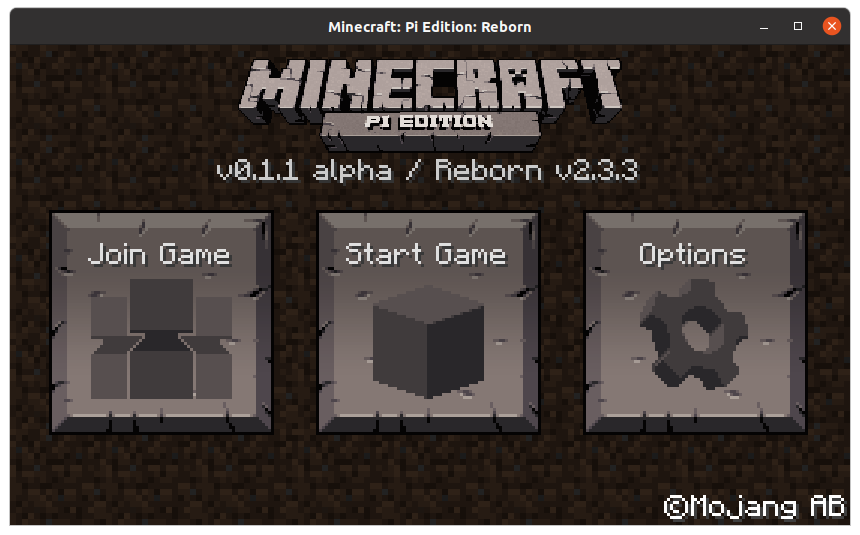

# Minecraft: Pi Edition: Reborn
Minecraft: Pi Edition Modding Project

## Installation

### Option A: Pi-Apps (Raspberry Pi Only)
  

### Option B: Manual Installation
[View Manual Installation](docs/INSTALL.md)

## Documentation
- [View Overriding Assets](docs/OVERRIDING_ASSETS.md)
- [View Troubleshooting](docs/TROUBLESHOOTING.md)
- [View Dedicated Server](docs/DEDICATED_SERVER.md)
- [View Modding](docs/MODDING.md)
- [View Credits](docs/CREDITS.md)